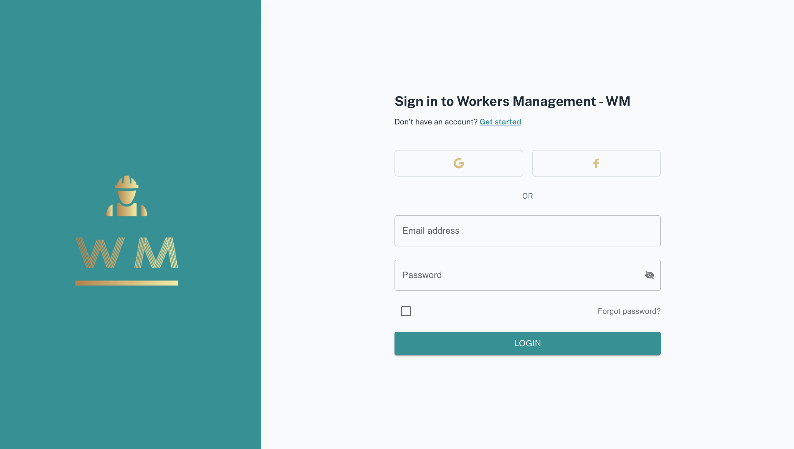
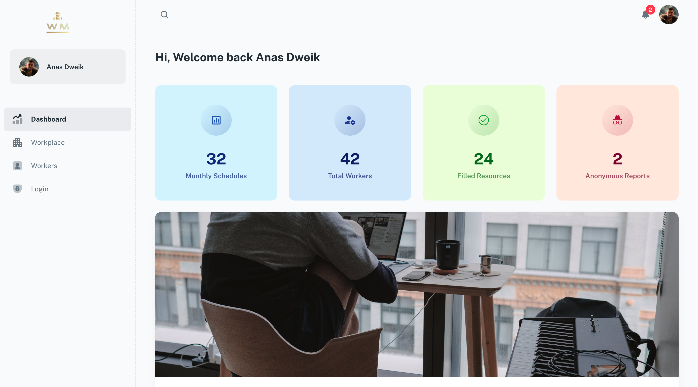
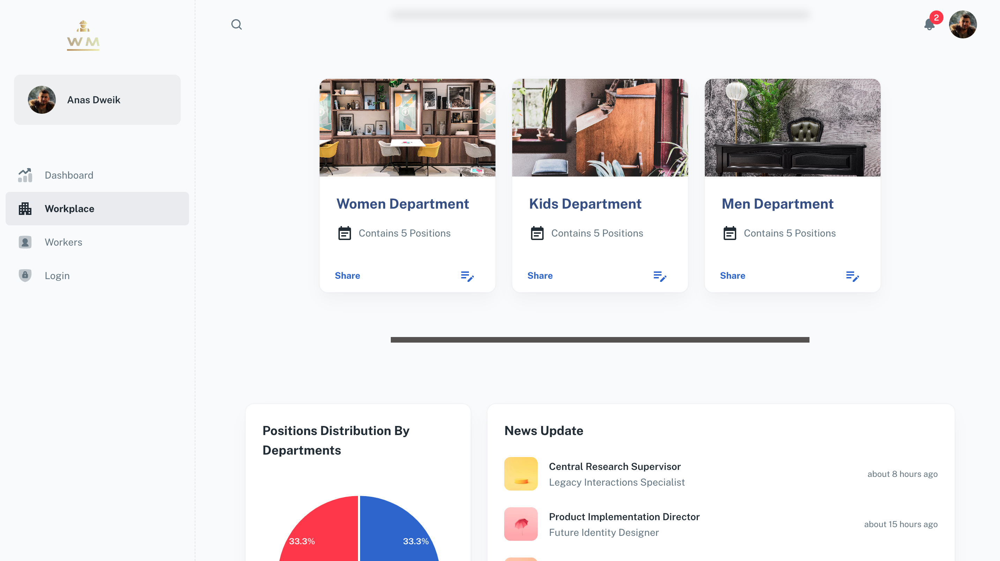
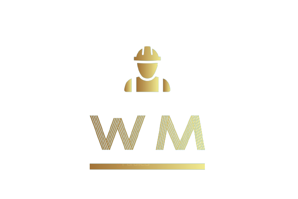

## Workers Management - [( WM )]()

> React Admin Dashboard made with Material-UI components and React.

> The system empowers managers with comprehensive administrative tools, granting them full authority to govern and supervise all aspects of the operations.

> Users will find the website easy to navigate due to its simple and intuitive design

#

#

> Experience a more straightforward and effective managerial approach that enhances productivity, saves time, and promotes a harmonious work environment. Join us today and revolutionize the way you manage your team!

#

| [WM]() | [Used Features]()           |
| ------ | :-------------------------- |
| -      | ✓ MUI components            |
| -      | ✓ Firebase - Authentication |
| -      | ✓ Firebase - FireStore      |
| -      | ✓ [0 css lines]()           |
| -      | ✓ React.jsx version         |
| -      | ✓ JavaScript version        |
| -      | ✓ User-Friendly Interface   |
| -      | ✓ Administrative Tools      |

#

> Managers can effortlessly connect with their team using our system, fostering a streamlined channel for communication. Stay connected in real-time, exchange updates, and engage in dialogue effortlessly, eliminating the need for extensive back-and-forth communication.

#

## Page demo

- [Dashboard]()
- [WorkPlace]()
- [Workers]()
- [Login]()
- [InvitationPage]()
- [Not Found]()

#

#

## Getting started

- Install dependencies: `npm install` / `yarn install`
- Start the project: `npm run start` / `yarn start`

## Contact me

Email Me: anas.e.dweik@gmail.com

# Workers Managment - WM

